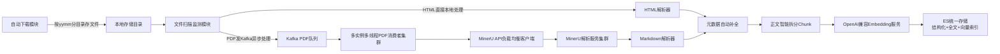

# arXiv论文全链路采集解析入库系统
生产级高可用架构，支持TB级论文数据自动化采集、解析、索引、检索全流程

---
## 核心特性
✅ **全自动增量采集**：按`yymm.xxxxx`ID规则自动探测，按月分目录存储，断点续传，7秒防封间隔，自动跳转月份/循环采集当月新论文  
✅ **下载解析完全解耦**：下载模块仅负责存文件，扫描监测模块异步处理，无直接依赖，支持独立升级扩展  
✅ **性能最优分层解析**：HTML文件直接本地解析（毫秒级），PDF文件异步调用MinerU API集群解析（高吞吐并行处理）  
✅ **智能元数据补全**：解析缺失字段自动调用arXiv官方API补全，ES自动缓存，避免重复请求  
✅ **OpenAI兼容向量化**：支持所有兼容OpenAI接口的Embedding服务（官方/本地部署/国内厂商），自动chunk拆分带重叠窗口  
✅ **ES统一存储架构**：一份存储同时支持结构化查询、全文检索、向量检索，无需维护多套存储  
✅ **MinerU集群级调度**：最少连接优先负载均衡，自动健康检测/故障转移/重试，支持水平扩展，吞吐随集群规模线性提升  
✅ **高可靠保障**：全链路重试、幂等去重、手动offset提交、已处理文件持久化记录、定期全量扫描兜底，不丢不重

---
## 整体架构

---
## 快速开始
### 1. 环境依赖
- Docker + Docker Compose
- Python 3.10+
- （可选）已部署的MinerU API集群、Embedding API服务

### 2. 启动基础服务
```bash
docker-compose up -d
# 启动后会运行Kafka、ZooKeeper、Elasticsearch
```

### 3. 初始化ES索引
```bash
python scripts/init_es.py
```

### 4. 安装依赖
```bash
pip install -r requirements.txt
```

### 5. 修改配置
编辑`config/default.yaml`，至少配置：
- `embed`部分：你的Embedding API地址、密钥、模型
- `mineru`部分：你的MinerU API集群地址列表

### 6. 启动服务
```bash
# 1. 启动自动下载服务（默认从当前月开始下载）
python src/main.py download &

# 2. 启动文件扫描监测服务（HTML直接解析，PDF入队）
python src/main.py scan &

# 3. 启动PDF解析消费者（多线程并行调用MinerU集群）
# 可多实例部署，线性提升PDF解析吞吐
python src/main.py consumer pdf &

# 4. 启动Markdown处理消费者（解析+向量化+入库）
python src/main.py consumer markdown &
```

---
## 配置说明
### 核心配置项
| 模块 | 配置项 | 说明 |
|------|--------|------|
| **arxiv** | `request_interval` | 两次请求间隔，默认7秒，请勿调低避免被arXiv封禁 |
| | `max_missing_count` | 连续不存在阈值，超过则判定当月采集完成 |
| | `current_month_wait` | 当前月扫描完成后等待时间，默认10分钟 |
| **download** | `start_month` | 起始采集月份，格式`yymm`，例如`2601`，空则默认当前月 |
| **mineru** | `api_servers` | MinerU API集群地址列表，例如`["http://mineru1:8000", "http://mineru2:8000"]` |
| | `shared_storage` | 是否共享存储，是则直接传文件路径，性能高10倍+ |
| | `load_balance_strategy` | 负载策略：`least_conn`(优先空闲服务，推荐)/`round_robin`(轮询) |
| **embed** | `base_url` | OpenAI兼容Embedding服务地址 |
| | `api_key` | API密钥 |
| | `model` | Embedding模型名称 |
| | `vector_dim` | 模型输出向量维度，必须和实际模型匹配 |
| **kafka** | `bootstrap_servers` | Kafka集群地址 |

---
## 集群部署最佳实践
### 最大化PDF解析吞吐
1. MinerU集群有N个节点 → 启动N个PDF消费者线程（默认自动匹配，无需配置）
2. 可多机部署多个PDF消费者实例，Kafka自动分配消息，总并行度=实例数×单实例线程数，总并行度不要超过MinerU集群总处理能力
3. 务必开启`shared_storage: true`，让所有MinerU节点和消费者都能直接访问PDF存储目录，避免大文件上传开销
4. Kafka分区数建议≥消费者总线程数，避免消息挤压

### 高可用部署
1. Kafka集群至少3个节点，配置副本数≥2
2. ES集群至少3个节点，配置副本数≥1
3. 下载服务、扫描服务可部署多实例，通过分布式锁避免重复下载（默认单实例足够，如需多实例可加Redis锁）
4. 消费者服务无状态，可任意水平扩展

---
## 目录结构
```
arxiv-paper-pipeline/
├── config/              # 配置文件目录
├── src/
│   ├── main.py          # 统一入口
│   ├── downloader/      # 自动下载模块
│   ├── scanner/         # 文件扫描监测模块
│   ├── parser/          # 解析器（HTML/Markdown/MinerU API客户端）
│   ├── processor/       # 处理模块（元数据补全/Chunk拆分/向量化/论文全流程处理）
│   ├── kafka/           # Kafka生产者/消费者
│   ├── storage/         # ES存储客户端
│   ├── models/          # 数据模型（Paper结构定义）
│   └── utils/           # 工具类（日志/重试）
├── scripts/             # 初始化脚本
├── data/                # 数据目录（下载文件/进度记录/已处理文件记录）
├── logs/                # 日志目录
├── docker-compose.yml   # 基础服务编排
├── requirements.txt     # 依赖
└── README.md
```

---
## 常见问题
### Q：如何修改采集起始月份？
A：修改`config/default.yaml`的`download.start_month`，例如`start_month: "2601"`表示从2026年1月开始采集。

### Q：支持哪些Embedding服务？
A：所有兼容OpenAI API规范的服务都支持，包括官方OpenAI、Ollama本地部署、Text Embedding Inference、国内所有大厂商的Embedding服务、OneAPI聚合接口等。

### Q：PDF解析失败怎么办？
A：系统自动重试3次，切换不同的MinerU节点，重试失败的消息会留在Kafka队列，下次消费会重新处理，无需人工干预。

### Q：重启服务会不会重复处理文件？
A：不会，已处理文件会持久化记录，扫描服务会自动跳过已处理文件；Kafka消费者手动提交offset，处理成功才会标记为已消费。
